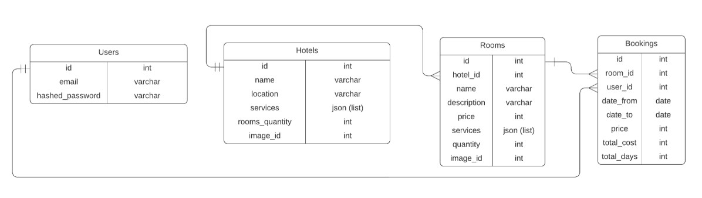

# Бронирование отелей
(ДОКУМЕНТАЦИЯ В РАЗРАБОТКЕ)

Сервис по бронированию отелей позволяет найти и забронировать комнату на определенный период времени в нужной комнате отеля.
## Содержание
___
- [Развертывание](#развертывание)
- [Запуск](#запуск)
- [Доступные эндпоинты](#доступные-эндпоинты)
- [Схема таблиц в БД](#схема-таблиц-в-БД)
## Развертывание
___
Установите зависимости из requirements.txt:
```commandline
pip install -r requirements.txt
```
Создайте файл ```.env``` с указанием переменных:
```commandline
MODE=DEV
LOG_LEVEL=INFO

DB_HOST=XXX.XXX.XXX.XXX
DB_PORT=XXXX
DB_USER=XXXX
DB_PASS=XXXX
DB_NAME=XXXX

TEST_DB_HOST=XXX.XXX.XXX.XXX
TEST_DB_PORT=XXXX
TEST_DB_USER=XXXX
TEST_DB_PASS=XXXX
TEST_DB_NAME=XXXX

SECRET_KEY=XXXX
ALGORITHM=HS256

SMTP_HOST=smtp.gmail.com
SMTP_PORT=465
SMTP_USER=xxx@gmail.com
SMTP_PASS=xxx

REDIS_HOST=localhost
REDIS_PORT=6379
```
Создаем файлы миграции (Если папка **migration** существует - пропустить этот шаг):
```commandline
alembic init migration
```
Из папки где находится **alembic.ini**(обычно корень проекта) выполнить инициацию миграций:
```commandline
alembic revision --autogenerate -m "Initial migration"
```
Прогнать миграцию:
```commandline
alembic upgrade head
```
Вставить тестовые данные из файла test_data_db.sql для БД и выполнить. (Например в Query PgAdmin).
Выполнять по запросно. 

Если что-то в процессе пошло не так, для отката используете:
```commandline
alembic downgrade -1
```

## Схема таблиц в БД
___


## Запуск
___
Для запуска основного приложения FastAPI из корневой директории:

```commandline
uvicron app.main:app --reload
```

Сервис доступен по умолчанию на адресе - ```http://127.0.0.1:8000/```

### Celery & Flower

Для запуска Celery из корневой директории используется команда:

```commandline
celery --app=app.tasks.celery:celery worker -l INFO -P solo
```

Для запуска Flower из корневой директории используется команда:
```commandline
celery --app=app.tasks.celery:celery flower
```

### Dockerfile

Для запуска dockerfile из корневой директории используется команда:
```commandline
docker build .
```

### Docker Compose

Для запуска всех сервисов (БД, Redis, веб-сервер (FastAPI), Celery, Flower, Grafana, Prometheus) из корневой директории используется команда:
```commandline
docker compose build
docker compose up
```
## Доступные эндпоинты
___
Документация доступна по умолчанию```http://127.0.0.1:8000/docs```

### Отели
**GET**```/hotels/{location}``` - Поиск отелей по локации

***Например:
%лта% = Алтай***

**GET** ```/hotels/id/{hotel_id}``` - Информация по конкретному отелю

**GET** ```/hotels/{hotel_id}/rooms``` - Информация по конкретному отелю и его комантам на определенную дату

### Auth & Пользователи
**POST** ```/auth/register``` - Регистрация нового пользователя

***Например:
{"email": "user@example.com", "password": "string"}***

**POST** ```/auth/login``` - Аутентификация пользователя

***Например:
{"email": "user@example.com", "password": "string"}***

**POST** ```/auth/logout``` - Завершение сессии пользователя

**GET** ```/auth/me``` - Информация о текущем пользователе (hashed_password, email, id)

**GET** ```/auth/all``` - Информация о всех пользователях (hashed_password, email, id)

### Бронирования

**GET** ```/bookings``` - Информация о бронированиях текущего пользователя

**POST** ```/bookings``` - Новое бронирование для текущего пользователя

**DELETE** ```/bookings/{booking_id}``` - Удаление бронирования текущего пользователя по его id

### Import and add CSV to DB (В разработке)

~~**POST** ```/import/{table_name}``` - Импорт данных из CSV в базу данных~~

### Frontend

**GET** ```/pages/hotels``` - Визуальное отображение найденных отелей по локации. Работет на основе ```/hotels/{location}```

### Загрузка картинок

**POST** ```/images/hotels``` - Загрузка картинок для новых отелей


### Остальные

**GET** ```/metrics``` - Получение метрик prometheus

**GET** ```/admin``` - Панель администрирования всех имеющихся данных в БД

При использовании **docker compose**:

```http://localhost:9090/``` - Метрики Prometheus

```http://localhost:3000/``` - Отображение метрик Grafana

```http://localhost:5555/``` - Мониторинг и администрирование Celery Flower

___


